# Zhenyi - Multi-Agent Research System

<div align="center">

</div>

Zhenyi is an open-source multi-agent AI system that conducts autonomous research by orchestrating multiple LLM providers, scraping diverse data sources, and synthesizing coherent answers. Built with **dynamic role assignment**, **intelligent resource scheduling**, and **transparent reasoning chains**.

Named after Wang Zhenyi (1768–1797), a pioneering Chinese mathematician and astronomer who embodied the spirit of rigorous inquiry.

> **⚠️Status**: This is an experimental project in active development. APIs and all the features may change. Use at your own discretion.

## Quick Start

```bash
# 1. Clone and setup
git clone https://github.com/ShamalLakshan/zhenyi.git
cd zhenyi
python -m venv venv
source venv/bin/activate  # Windows: venv\Scripts\activate

# 2. Install and configure
pip install -r requirements.txt
cp .env.example .env
# Edit .env with your free-tier API keys

# 3. Run
uvicorn server:app --reload --host 0.0.0.0 --port 8000

# 4. Open browser
# http://localhost:8000
```

## How It Works



See [docs/ARCHITECTURE.md](docs/ARCHITECTURE.md) for detailed pipeline design.

## Features

- **Multi-LLM Orchestration** - Seamlessly work with 6+ providers (Gemini, Groq, OpenRouter, Cerebras, Cohere, GitHub)
- **9 Built-in Scrapers** - HackerNews, ArXiv, Wikipedia, SEC Edgar, YouTube, Web Search, and more
- **Smart Filtering** - Triage removes irrelevant data before analysis
- **Parallel Processing** - Scrapers and analysts run concurrently for speed
- **Transparent Chains** - Full audit trail of reasoning for every query
- **Free-Tier Friendly** - Uses only free APIs; no paid services required
- **Real-time Updates** - WebSocket events for frontend progress tracking
- **Production Ready** - SQLite persistence, circuit breaker pattern, error recovery

## Documentation

- **[Setup Guide](docs/SETUP.md)** - Installation and configuration
- **[Architecture](docs/ARCHITECTURE.md)** - System design and pipeline stages
- **[API Reference](docs/API.md)** - REST/WebSocket endpoints
- **[Development Guide](docs/DEVELOPMENT.md)** - Contributing and extending

## System Requirements

- Python 3.9+
- Free API keys (Gemini recommended as starting point)
- 2+ GB RAM
- Internet connection (for scrapers)

## Supported LLM Providers

All free-tier with no credit card required:

| Provider | Model | Free Quota |
|----------|-------|-----------|
| **Google Gemini** | gemini-2.5-flash | 1,000/day |
| **Groq** | llama-3.1/3.3 | 14,400/day |
| **OpenRouter** | meta-llama/llama-3.3-70b | 200/day |
| **Cerebras** | llama3.1-8b | 14,400/day |
| **Cohere** | command-a-03-2025 | 1,000/day |
| **GitHub Models** | gpt-4o-mini | 150/day |

See [docs/SETUP.md](docs/SETUP.md) for getting keys.

## Scrapers

- **hackernews** - Tech news and discussions
- **arxiv** - Academic papers and research
- **wikipedia** - General knowledge
- **web** - DuckDuckGo search results
- **youtube** - Video descriptions and metadata
- **sec_edgar** - Financial filings (US only)
- **openalex** - Academic metadata
- **open_meteo** - Weather and climate data
- **ddgs** - Web search alternative

## Example Usage

**Via Web UI**:
1. Open http://localhost:8000
2. Enter your query
3. Watch real-time pipeline progress
4. Read synthesized answer with citations

**Via API**:
```bash
curl -X POST http://localhost:8000/api/query \
  -H "Content-Type: application/json" \
  -d '{"query": "Latest breakthroughs in quantum computing"}'

# Result with query_id
# Use WebSocket to watch progress: ws://localhost:8000/ws/query/{query_id}
```

## Architecture Highlights

- **Dynamic Role Assignment** - Orchestrator assigns agents based on query type and provider availability
- **Circuit Breaker** - Graceful degradation when scrapers/APIs fail
- **Key Pool Management** - Automatic provider rotation and fallback
- **Event Bus** - Real-time pipeline events for frontend updates
- **Structured Persistence** - SQLite with full query history and reasoning traces

## Contributing

Contributions welcome. See [docs/DEVELOPMENT.md](docs/DEVELOPMENT.md) for:
- Adding new scrapers
- Supporting new LLM providers
- Extending agent roles
- Contributing to frontend

Process:
1. Fork repository
2. Create feature branch
3. Make changes with tests
4. Open pull request

## Status

Active development. Core features stable; APIs subject to change during v0.x phase.

## License

[License file](LICENSE) - to be determined

## Questions?

- Check [docs/SETUP.md](docs/SETUP.md) for installation issues
- See [docs/DEVELOPMENT.md](docs/DEVELOPMENT.md) for architecture questions
- Read [docs/API.md](docs/API.md) for endpoint reference

## Acknowledgments

Named after Wang Zhenyi (1768–1797), whose pioneering work in mathematics and astronomy exemplifies the spirit of intelligent inquiry that guides this project.
